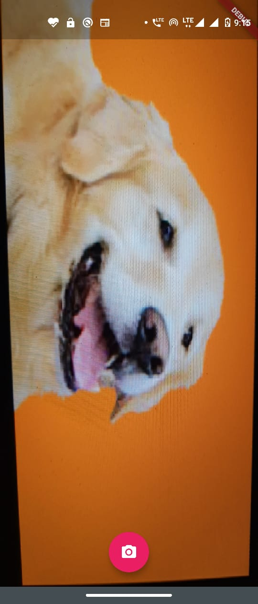

# Cats-Vs-Dogs classifier.

Created Cats-vs-Dogs classifer as a Hello World Example of Deep Learning on Mobile Devices. I trained Convolutional Neural Network to Kaggle Dataset kaggle biaiscience/dogs-vs-cats.

## Some screenshots are given below.

### 1) Camera Interface

### 2) Classification

### 3) Predicted Dog

### 4) Predicted Cat
